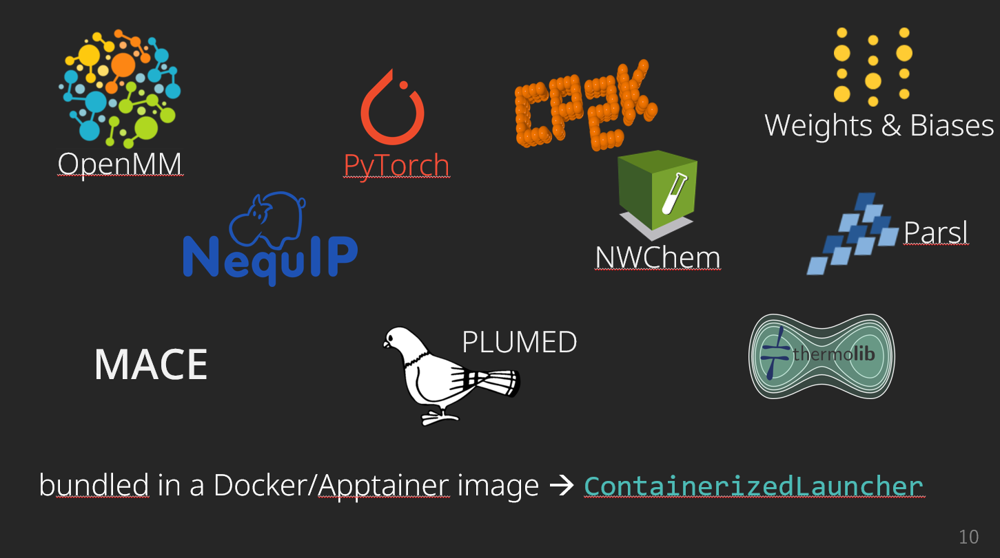

Nov 3, 2023: We're preparing v3.0.0, which introduces some breaking changes that are not yet reflected in the docs (mostly with respect to the execution configuration) -- we will fix this soon.

# Interatomic potentials using online learning

Psiflow is a **modular** and **scalable** library for developing interatomic potentials. It interfaces popular trainable interaction potentials with quantum chemistry software and is designed to support computational workflows on hundreds or thousands of nodes. Psiflow is designed as an end-to-end framework; it can orchestrate all computational components between an initial atomic structure and the final trained potential. In particular, it implements a variety of **active learning** algorithms which allow for efficient exploration of the system's phase space **without requiring ab initio molecular dynamics**.

Its features include:

- active learning algorithms with enhanced sampling using PLUMED
- [Weights & Biases](wandb.ai) logging for easy monitoring and analysis
- periodic (CP2K) and nonperiodic (PySCF, NWChem) systems
- efficient GPU-accelerated molecular dynamics using OpenMM
- the latest equivariant potentials such as MACE and NequIP

Execution is massively parallel and powered by [Parsl](https://parsl-project.org/), a parallel execution library which supports a variety of execution resources including clouds (e.g. Amazon Web Services, Google Cloud), clusters (e.g. SLURM, Torque/PBS, HTCondor) and even container orchestration systems (e.g. Kubernetes).
While psiflow exposes an intuitive and concise API for defining complex molecular simulation workflows in a single Python script, Parsl ensures that the execution is automatically offloaded to arbitrarily large amounts of compute resources.
Visit the [documentation](https://molmod.github.io/psiflow) for more details.

___

Check out this seven-minute introduction to psiflow:

which was recorded at [ParslFest 2023](https://parsl-project.org/parslfest/parslfest2023.html)
