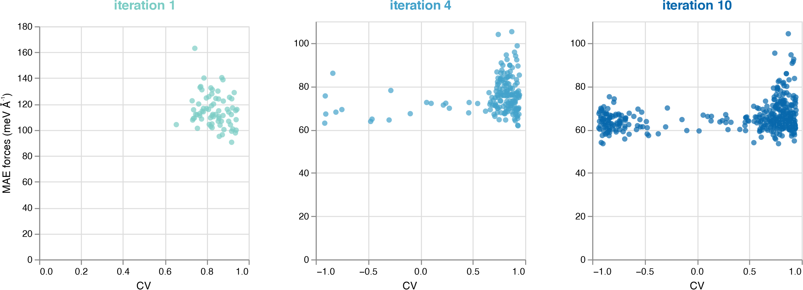

# Examples
Psiflow can be used to implement many different simulation workflows,
ranging from simple active learning to enhanced sampling molecular dynamics or
more advanced uncertainty-based high-throughput learning.
In all cases, the main driver of the workflow is a single Python script that
starts with a `psiflow.load()` command which loads the execution parameters from
a configuration file and initializes the internal cache directory in which
to store log files of various kinds
(assumed to be located at `./psiflow_internal/`).

Below, we will showcase the functionality of psiflow using a number of examples.
The input files required to execute these examples can be found on the GitHub
repository, in the
[data](https://github.com/svandenhaute/psiflow/tree/main/examples/data) folder.
If you have not already, be sure to check out the
psiflow [Overview](overview.md) first!


## Simple training and validation
The following example demonstrates how to use an existing dataset to train an
interatomic potential, and evaluate its performance based on a short molecular dynamics
trajectory. Click
[here](https://github.com/svandenhaute/psiflow/tree/main/examples/run_train_npt.py)
for the full example.
??? note "import statements and helper functions"
    ```py
    import requests     # required for downloading cp2k input
    import logging
    from pathlib import Path
    import numpy as np

    import psiflow
    from psiflow.models import MACEModel, MACEConfig
    from psiflow.data import Dataset
    from psiflow.reference import CP2KReference
    from psiflow.sampling import DynamicWalker
    ```
    The `get_reference()` helper function defines a generic PBE-D3/TZVP reference level of theory.
    Basis set, pseudopotentials, and D3 correction parameters are obtained from
    the official CP2K repository, v9.1, and saved in the internal directory of
    psiflow. The input file is assumed to be available locally.
    ```py
    def get_reference():
        with open(Path.cwd() / 'data' / 'cp2k_input.txt', 'r') as f:
            cp2k_input = f.read()
        reference = CP2KReference(cp2k_input=cp2k_input)
        basis     = requests.get('https://raw.githubusercontent.com/cp2k/cp2k/v9.1.0/data/BASIS_MOLOPT_UZH').text
        dftd3     = requests.get('https://raw.githubusercontent.com/cp2k/cp2k/v9.1.0/data/dftd3.dat').text
        potential = requests.get('https://raw.githubusercontent.com/cp2k/cp2k/v9.1.0/data/POTENTIAL_UZH').text
        cp2k_data = {
                'basis_set': basis,
                'potential': potential,
                'dftd3': dftd3,
                }
        for key, value in cp2k_data.items():
            with open(psiflow.context().path / key, 'w') as f:
                f.write(value)
            reference.add_file(key, psiflow.context().path / key)
        return reference
    ```

    The `get_mace_model()` helper function defines the model architecture for
    the potential we want to train, in this case MACE.
    A full list of parameters can be found in the MACE repository, or in the
    psiflow source code at `psiflow.models._mace`.
    ```py
    def get_mace_model():
        config = MACEConfig()           # load default MACE parameters
        config.max_num_epochs = 1000
        config.r_max = 6.0
        return MACEModel(config)
    ```

```py
def main(path_output):
    train = Dataset.load('data/Al_mil53_train.xyz')
    valid = Dataset.load('data/Al_mil53_valid.xyz')
    model = get_mace_model()
    model.initialize(train)
    model.train(train, valid)
    model.deploy()

    walker = DynamicWalker(train[0], steps=300, step=50)
    _, trajectory = walker.propagate(model=model, keep_trajectory=True)
    reference = get_reference()
    errors = Dataset.get_errors( # compare model and DFT predictions
            reference.evaluate(trajectory),
            model.evaluate(trajectory),
            metric='rmse',          # 'mae' or 'max' are also possible
            )
    errors = np.mean(errors.result(), axis=0)
    print('energy error [RMSE, meV/atom]: {}'.format(errors[0]))
    print('forces error [RMSE, meV/A]   : {}'.format(errors[1]))
    print('stress error [RMSE, MPa]     : {}'.format(errors[2]))
    model.save(path_output)


if __name__ == '__main__':              # entry point
    psiflow.load(
            '../configs/local_wq.py',   # path to psiflow config file
            './psiflow_internal',       # internal psiflow cache dir
            )

    path_output = Path.cwd() / 'output' # stores final model
    main(path_output)
```
The following operations are performed:

- The (existing) datasets are loaded as `Dataset` objects; one for training,
one for validation.
- A `MACEModel` is initialized based on the training data. In particular, this
includes calculating the average number of neighbors for each atom given a
specific cutoff radius (used for normalization purposes throughout
the network) or the average atomic energies. All network parameters are initialized
in this step as well.
- The model is trained using both the training and validation sets. The actual
output logs of the training (as you would normally obtain when training a MACE
model outside of psiflow) are stored in the seemingly peculiar
`psiflow_internal/000/task_logs/0000` directory. Fear not; except for
output logs, users do not need to venture into `psiflow_internal`.
After the training, the model is (formally) deployed. In the specific case of
MACE, deploying does not have any practical implications yet. For NequIP models,
deploying essentially boils down to calling `torch.jit.compile()` on the entire
model.
- A dynamic walker is initialized and used to perform molecular dynamics using
the newly trained model; we use the `keep_trajectory` option to ensure that the
walker returns not just the final state but the entire trajectory.
- The reference level of theory is used to perform singlepoint evaluations
of each of the states in the trajectory. Note that this will automatically
proceed in a massively parallel manner as there exists no dependency between
the evaluation of consecutive states.
- The obtained QM energy/forces/stress of each of the states in the trajectory
are compared with the MACE predictions in the RMS sense.
- the model is saved in the output directory (here: `./output/`) -- this will
generate a total of 3 files: `MACEModel.yaml`, `config_after_init.yaml`, and
the actual PyTorch model `model_undeployed.pth`.

## Online learning 1: sequential learning with metadynamics
The next example demonstrates the most straightforward way of doing
online learning with psiflow; the `SequentialLearning` class.
Click
[here](https://github.com/svandenhaute/psiflow/tree/main/examples/run_sequential_learning.py)
for the full example.

??? note "import statements and helper functions"
    ```py
    import requests
    import logging
    from pathlib import Path
    import numpy as np

    from ase.io import read

    import psiflow
    from psiflow.learning import SequentialLearning, load_learning
    from psiflow.models import NequIPModel, NequIPConfig
    from psiflow.reference import CP2KReference
    from psiflow.data import FlowAtoms, Dataset
    from psiflow.sampling import BiasedDynamicWalker, PlumedBias
    from psiflow.state import load_state        # necessary for restarting a run
    from psiflow.wandb_utils import WandBLogger # takes care of W&B logging
    ```
    Helper functions that were defined in previous examples are not repeated
    here -- see the Python file on Github for a complete script.

    The `get_bias()` helper function defines the metadynamics bias settings
    that are used during the phase space exploration by the walkers.
    ```py
    def get_bias():
        plumed_input = """
    UNITS LENGTH=A ENERGY=kj/mol TIME=fs
    CV: VOLUME
    METAD ARG=CV SIGMA=200 HEIGHT=5 PACE=100 LABEL=metad FILE=test_hills
    """
        return PlumedBias(plumed_input)
    ```
    The `get_nequip_model()` helper function is similar to its MACE equivalent;
    all parameters are stored in a `NequIPConfig` dataclass which is can be
    modified before creating the `NequIPModel`.
    ```py
    def get_nequip_model():
        config = NequIPConfig()
        config.r_max = 4.5
        return NequIPModel(config)
    ```

```py
def main(path_output):
    assert not path_output.is_dir()
    reference = get_reference()     # CP2K; PBE-D3(BJ); TZVP
    model = get_nequip_model()      # NequIP; default model
    bias  = get_bias()              # simple MTD bias on unit cell volume
    atoms = read(Path.cwd() / 'data' / 'Al_mil53_train.xyz') # single structure

    # set up wandb logging
    wandb_logger = WandBLogger(
            wandb_project='psiflow',
            wandb_group='run_sequential',
            error_x_axis='CV',  # plot errors against PLUMED variable; 'ARG=CV'
            )

    # set learning parameters and do pretraining
    learning = SequentialLearning(
            path_output=path_output,
            niterations=10,
            train_valid_split=0.9,
            train_from_scratch=True,
            pretraining_nstates=50,
            pretraining_amplitude_pos=0.1,
            pretraining_amplitude_box=0.05,
            use_formation_energy=True,
            wandb_logger=wandb_logger,
            )

    # construct walkers; biased MTD MD in this case
    walkers = BiasedDynamicWalker.multiply(
            30,
            data_start=Dataset([atoms]),
            bias=bias,
            timestep=0.5,
            steps=400,
            step=50,
            start=0,
            temperature=600,
            pressure=0, # NPT
            force_threshold=30,
            initial_temperature=600,
            )
    data_train, data_valid = learning.run(
            model=model,
            reference=reference,
            walkers=walkers,
            )


if __name__ == '__main__':              # entry point
    psiflow.load(
            '../configs/local_wq.py',   # path to psiflow config file
            './psiflow_internal',       # internal psiflow cache dir
            )

    path_output = Path.cwd() / 'output' # stores output from each iteration
    main(path_output)
```
The following operations are performed:

- The main objects to be used during the online learning are created; a bias, a
trainable potential, the reference level of theory, and an ASE `atoms`
instance which defines the initial structure which the phase space
exploration will start from in the first iteration.
- The `WandBLogger` is instantiated. While optional, it is highly recommended
to use this.
After each loop of (sampling, QM evaluation, training), the logger
will generate useful analysis graphs on Weights & Biases
(although this requires some configuration by the user;
see the [W&B tutorial](https://docs.wandb.ai/quickstart) for more information).
These graphs show the energy, forces, and stress errors in each iteration
by the model, optionally plotted against (one of) the collective variable(s)
along which the bias potential is applied, for additional insight.
- The `SequentialLearning` object is created.
It centralizes all learning-level parameters such as the number of
iterations, the number
of (parallel) molecular dynamics simulations to perform, the train/validation
split, whether to train to absolute or formation energies etc.
In addition, it takes care of saving models,
datasets, and the state of the walkers and/or bias potentials for each iteration.
- After the pretraining, the sampling parameters of the molecular dynamics
simulation are defined using the `multiply` class method from 
`BiasedDynamicWalker`.
All walkers share the same parameters but
will receive different initial velocities,
different initial configurations, and will **not** share any metadynamics
hills files; i.e. each metadynamics run is independent from the others.
The returned object is simply a Python `list` of walkers.
- The actual iterative algorithm is executed by calling `learning.run()`.
The state of walker `i` and its bias potential at the end of iteration `j` are
used as starting point for walker `i` in iteration `j+1`.
In this way, the walkers explore a new region in each iteration, and due to
the bias will increasingly explore higher-energy regions.
Initial training and validation sets are generated by applying
small random perturbations to the initial states of each of the walkers;
this can serve as a sufficient initial dataset based on which the NequIP model
may be briefly trained as a first (and inexpensive) step.
This approach to online learning is extensively discussed in the original
[psiflow paper](https://www.nature.com/articles/s41524-023-00969-x).
At the end of each iteration, the state of all walkers, the trained model,
and the obtained (and QM-evaluated) data are saved in the specified
output folder, and if enabled, logged to W&B.
<figure markdown>
  
  <figcaption>Force errors as a function of the collective variable and the
  iteration in a learning algorithm, as visualized in W&B. In this case,
  NequIP was used to model the proton hopping process in aluminum-doped zeolites;
  collective variable values of 1 and -1 represent a stable O-H bond; a value
  of 0 indicates a transition from one oxygen to another.
  </figcaption>
</figure>

After completing the requested number of learning iterations (as specified with
the `niterations` keyword argument), psiflow will exit and the output folder will
contain the state of the entire system (datasets, walker and bias states, models) after each step.

## Online learning 2: concurrent learning with umbrella sampling
Sometimes, it is more efficient to allow
data generation and model training to proceed *simultaneously* instead of sequentially.
In that case, walkers are propagated through phase space with whatever best model
is currently available; and models are trained with however many states are
currently present in train and validation datasets.
This is especially useful when dealing with large networks that need to be fitted
to complex datasets, as the time required for model training will become nontrivial, even with
state of the art GPUs (a few hours or more on a single Nvidia A100).

In psiflow, this approach is implemented by the `ConcurrentLearning` class;
see below for an example with MACE and umbrella sampling.

??? note "import statements and helper functions"
    ```py
    import requests
    import logging
    from pathlib import Path
    import numpy as np

    from ase.io import read

    import psiflow
    from psiflow.learning import ConcurrentLearning, load_learning
    from psiflow.models import NequIPModel, NequIPConfig, MACEModel, MACEConfig
    from psiflow.reference import CP2KReference
    from psiflow.data import FlowAtoms, Dataset
    from psiflow.sampling import BiasedDynamicWalker, PlumedBias
    from psiflow.state import load_state
    from psiflow.wandb_utils import WandBLogger
    ```
    Helper functions that were defined in previous examples are not repeated
    here -- see the Python file on Github for a complete script.

    The `get_bias()` helper function defines the harmonic bias potential
    that is used by the walkers during phase space exploration.
    ```py
    def get_bias():
        plumed_input = """
    UNITS LENGTH=A ENERGY=kj/mol TIME=fs

    coord1: COORDINATION GROUPA=109 GROUPB=88 R_0=1.4
    coord2: COORDINATION GROUPA=109 GROUPB=53 R_0=1.4
    CV: MATHEVAL ARG=coord1,coord2 FUNC=x-y PERIODIC=NO
    cv2: MATHEVAL ARG=coord1,coord2 FUNC=x+y PERIODIC=NO
    lwall: LOWER_WALLS ARG=cv2 AT=0.65 KAPPA=5000.0
    RESTRAINT ARG=CV AT=0.0 KAPPA=1500.0
    """
        return PlumedBias(plumed_input)
    ```
    ```py
    def get_mace_model():
        config = MACEConfig()
        config.max_num_epochs = 1000
        config.r_max = 6.0
        return MACEModel(config)
    ```

```py
def main(path_output):
    assert not path_output.is_dir()
    reference = get_reference() # CP2K; PBE-D3(BJ); TZVP
    model = get_mace_model()    # MACE; small model
    bias  = get_bias()          # simple MTD bias on unit cell volume
    data  = Dataset.load(Path.cwd() / 'data' / 'zeolite_proton.xyz')

    # set up wandb logging
    wandb_logger = WandBLogger(
            wandb_project='psiflow',
            wandb_group='run_concurrent',
            error_x_axis='CV',  # plot errors against PLUMED 'ARG=CV'
            )

    # set learning parameters
    learning = ConcurrentLearning(
            path_output=path_output,
            niterations=10,
            train_from_scratch=True,
            pretraining_amplitude_pos=0.1,
            pretraining_amplitude_box=0.05,
            pretraining_nstates=50,
            train_valid_split=0.9,
            wandb_logger=wandb_logger,
            min_states_per_iteration=15,
            max_states_per_iteration=60,
            )

    # construct walkers; biased MD across the collective variable range of interest
    walkers = BiasedDynamicWalker.distribute(
            20,
            data,
            bias=bias,
            variable='CV',
            min_value=-0.975,
            max_value=0.975,
            timestep=0.5,
            steps=400,
            step=50,
            start=0,
            temperature=1000,
            pressure=0, # NPT
            force_threshold=30,
            initial_temperature=1000,
            )
    data_train, data_valid = learning.run(
            model=model,
            reference=reference,
            walkers=walkers,
            )
```
Naturally, the body of the `main` function is similar to the previous example;
the main difference being the use of a `ConcurrentLearning` instance
instead of a `SequentialLearning` instance.
