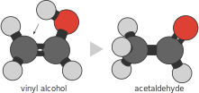

In Born-Oppenheimer-based molecular simulation, atomic nuclei are treated as classical
particles that are subject to *effective* interactions -- these are the result of the quantum
mechanical behavior of the electrons. These interactions determine the interatomic forces
which are used in a dynamic simulation to propagate the atomic positions from one timestep
to the next.
Traditionally, dynamic simulations required an explicit evaluation of these effective
forces in terms of a quantum mechanical calculation (e.g. DFT(B)).
Recently, it became clear that it is much more efficient to perform such simulations
using a machine-learned representation of the interaction energy, i.e. an ML potential. 
The development and application of ML potentials throughout large simulation workflows is in
fact one of the core applications of psiflow.

The `Hamiltonian` class is used to represent any type of interaction potential.
Examples are pre-trained, 'universal' models (e.g. [MACE-MP0](https://arxiv.org/abs/2401.00096)),
ML potentials trained within psiflow (see [ML potentials](model.md)), or a quadratic
(hessian-based) approximation to a local energy minimum, to name a few.
In addition, various sampling schemes employ bias potentials which are superimposed on the
QM-based Born-Oppenheimer surface in order to drive the system
along specific reaction coordinates (e.g. metadynamics, umbrella sampling).
Such bias potentials are also instances of a `Hamiltonian`.

By far the simplest hamiltonian is the Einstein crystal, which binds atoms to a certain
reference position using harmonic springs with a single, fixed force constant.

```py
from psiflow.geometry import Geometry
from psiflow.hamiltonians import EinsteinCrystal


# isolated H2 molecule
geometry = Geometry.from_string('''
    2
    H 0.0 0.0 0.0
    H 0.0 0.0 0.8
''')

einstein = EinsteinCrystal(geometry, force_constant=0.1)  # in eV/A**2

```
As mentioned earlier, the key feature of hamiltonians is that they represent an interaction energy between atoms,
i.e. they output an energy (and its gradients) when given a geometry as input.
Because hamiltonians might require specialized resources for their evaluation (e.g. an ML
potential which gets executed on a GPU), evaluation of a hamiltonian does not necessarily
happen instantly (e.g. if a GPU node is not immediately available). Similar to how
`Dataset` instances return futures of a `Geometry` when a particular index is queried,
hamiltonians return a future when asked to evaluate the energy/forces/stress of a
particular `Geometry`:

```py
energy = einstein.compute(geometry, 'energy')       # AppFuture of an energy (np.ndarray with shape (1,))
print(energy.result())                              # wait for the result to complete, and print it (in eV)


data = Dataset.load('snapshots.xyz')                # N snapshots
energy, forces, stress = einstein.compute(data)     # returns energy and gradients for each snapshot in data


assert energy.result().shape == (N,)                # one energy per snapshot
assert forces.result().shape == (N, max_natoms, 3)  # forces for each snapshot, with padded natoms
assert stress.result().shape == (N, 3, 3)           # stress; filled with NaNs if not applicable
```
An particularly important hamiltonian is MACE, one of the most ubiquitous ML potentials.
These are readily available in psiflow:

```py
from psiflow.hamiltonians import MACEHamiltonian


mace = MACEHamiltonian.mace_mp0()                   # downloads MACE-MP0 from github
forces = mace.compute(geometry, 'forces')           # evaluates the MACE potential on the geometry

forces = forces.result()                            # wait for evaluation to complete and get actual value

assert np.sum(np.dot(forces[0], forces[1])) < 0     # forces in H2 always point opposite of each other

assert np.allclose(np.sum(forces, axis=0), 0.0)     # forces are conservative --> sum to [0, 0, 0]
```
A unique feature of psiflow `Hamiltonian` instances is the ability to create a new
hamiltonian from a linear combination of two or more existing hamiltonians.
This is relevant for many types of free energy calculations and/or enhanced sampling
techniques, including umbrella sampling, Hamiltonian replica exchange, or thermodynamic
integration.
Let us consider the particular example of [umbrella
sampling](https://wires.onlinelibrary.wiley.com/doi/10.1002/wcms.66).
As activated event, we consider the decay of vinyl alcohol to acetaldehyde,
which consists of a proton jump from the oxygen to the opposite carbon:

<figure markdown="span">
  { width="500" }
  <figcaption>Transformation of vinyl alcohol into acetaldehyde by means of a proton jump.
      A reaction coordinate is constructed based on the distance of hydrogen with respect to
      oxygen and with respect to carbon. </figcaption>
</figure>

The harmonic restraint is implemented and evaluated via [PLUMED](https://www.plumed.org/).
In psiflow, this can be done by passing a plumed input string which describes the bias
potential into a `PlumedHamiltonian`.

```py
from psiflow.hamiltonians import PlumedHamiltonian

plumed_str = """UNITS LENGTH=A ENERGY=kj/mol
d_C: DISTANCE ATOMS=3,5
d_O: DISTANCE ATOMS=1,5
CV: COMBINE ARG=d_C,d_O COEFFICIENTS=1,-1 PERIODIC=NO
RESTRAINT ARG=CV KAPPA=1500 AT=0.0
"""

bias = PlumedHamiltonian(plumed_str)

```
To add this contribution to our MACE potential, we simply sum both hamiltonians:

```py
potential = mace + bias

# double check
alcohol = Geometry.load('vinyl_alcohol.xyz')
total_energy = potential.compute(alcohol, 'energy')
mace_energy  = mace.compute(alcohol, 'energy')
bias_energy  = bias.compute(alcohol, 'energy')

assert np.allclose(
    total_energy.result(),
    mace_energy.result() + bias_energy.result(),
)
```

Aside from bias potentials, the combination of multiple hamiltonians is also employed in
e.g. the calculation of anharmonic free energy corrections.
In that case, we consider a "base" potential energy surface which is described by a
general quadratic function (i.e. a 3Nx3N hessian matrix and a minimum-energy geometry)
and a small perturbation which describes the difference between the quadratic
function and the fully anharmonic potential.
The following code snippet demonstrates the construction of mixtures of the two energy
surfaces:
```py
# hessian computed via geometry optimization and finite differences
# see sampling section
type(hessian)  # np.ndarray
hessian.shape  # (3n, 3n)
type(minimum)  # Geometry
len(minimum)   # n

harmonic = Harmonic(minimum, hessian)   # create quadratic hessian; x.T @ H @ x / 2
delta = mace - harmonic

hamiltonanians = []     # linear intepolation between quadratic and MACE PES, in 10 steps
for scale in np.linspace(0, 1, 10):
    hamiltonians.append(hessian + scale * delta)

```
